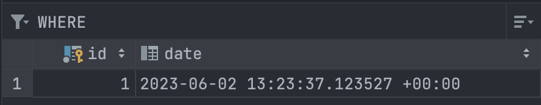
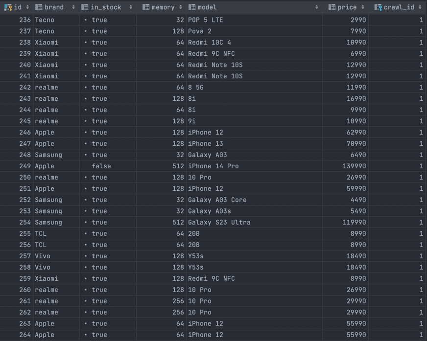
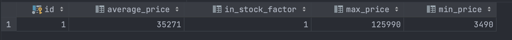
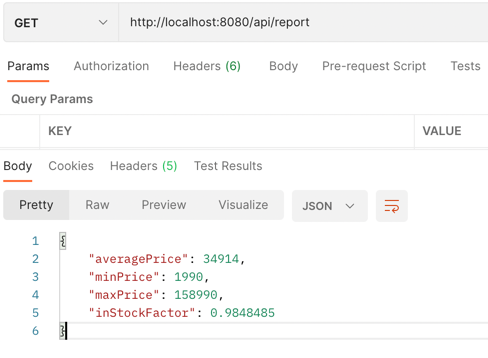

# data-crawler-service
REST-API сервис, который позволяет пользователям получать аналитику по парсингу сайтов конкурентов.

### Стек технологий
- Java 17
- Spring Boot
- Spring Web
- Hibernate
- Jsoup
- Lombok
- PostgreSQL
- Docker compose
- Slf4j
- Maven

### Масштабируемость
В проект заложен потенциал для масштабирования. 
Можно расширять список сайтов для парсинга, путем добавления
новых сервисов в сервис слой, аналогичных уже существующему.

### Бизнес логика
Главной сущностью является объект Report, который представляет
собой отчет о содержимом сайта. Report вычисляется на основе объекта
Crawl, состоящего из списка телефонов, полученных в определенную дату.
1) Пользователь делает GET запрос на http://localhost:8080/api/report
2) Сервис идет на сайт https://spb.shop.megafon.ru/mobile
3) Сервис собирает информацию о телефонах, кладет в Crawl со штампом даты
, а также сохраняет телефоны, датированные текущим временем, чтобы
потом можно было проанализировать изменение каталога за период времени

Таблица crawl



Таблица phone



Таблица report



Report 



### Развитие
- Можно добавить ресурсы для сбора более глубокой аналитики
по изменению каталога с течением времени, так как он сохраняется в базе
- Можно добавить ресурсы для сбора репортов, по дате, так как они сохраняются в базе
- Можно добавить ресурсы по сбору репортов с других сайтов, например по ключу
в урле
- Можно добавить новые метрики в репорты, или добавить новые виды репортов,
например для аналитики разного вида


### Инструкция по запуску 
Для контейнеризации был использован **Docker**.
В корне проекта находится файл docker-compose.yml,
который разворачивает на localhost два контейнера.
В первом контейнере находится образ субд Postgres,
во втором крутится REST-API сервис для парсинга.

1. Распаковать архив с решением
2. В корне проекта, где находится файл ```docker-compose.yml``` открыть терминал
3. В терминале прописать ```mvn install```
3. В терминале прописать ```docker-compose build```
4. После билда прописать ```docker-compose up```.
   После данных действий всё приложение развернётся на вашей системе и
   можно будет совершать запросы к сервису по ```http://localhost:8080/api/report```
5. Выполнение запроса требует времени, обычно около 30 секунд, это обусловлено
низкой скоростью работы Jsoup. На выходе получается примерно
250 объектов в базе телефонов + репорт по этой выборке. Можно собрать больше телефонов,
(~500), но это потребует еще большего времени.